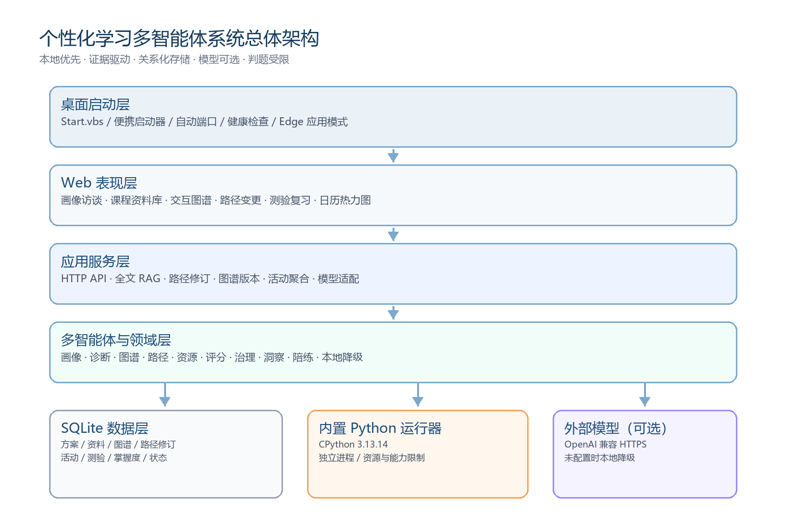
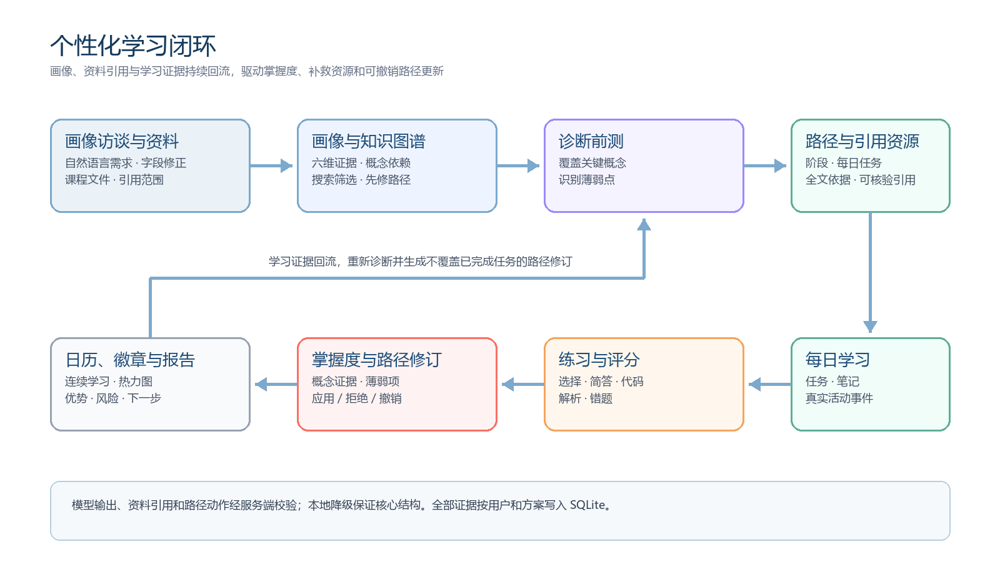

# 编制说明

本文档面向“基于大模型的个性化资源生成与学习多智能体系统”的竞赛评审、现场展示、部署维护与后续迭代，统一收录软件需求规格、系统方案设计、测试说明与测试报告、部署说明和用户操作手册。文档以当前 `main` 分支、版本 V0.1.0 的可运行代码和便携发布包为基线，并纳入成熟功能扩展设计中已经落地的能力。

本文档按 GB/T 8567—2006《计算机软件文档编制规范》组织总体结构，需求章节参考 GB/T 9385—2008《计算机软件需求规格说明规范》，测试章节参考 GB/T 9386—2008《计算机软件测试文档编制规范》，并吸收 ISO/IEC/IEEE 29148:2018 对需求工程完整性、可验证性和可追踪性的要求。标准只用于指导文档结构与质量控制，不表示本原型已完成任何第三方合规认证。

## 文档标识与控制

| 项目 | 内容 |
|---|---|
| 项目名称 | 基于大模型的个性化资源生成与学习多智能体系统 |
| 文档名称 | 参赛软件系统文档 |
| 文档编号 | PLS-MAS-DOC-001 |
| 软件版本 | V0.1.0 |
| 文档版本 | V1.1 |
| 基线分支 | main（已合入 Zip 便携构建能力） |
| 编制日期 | 2026-07-18 |
| 文档状态 | 参赛提交版 |
| 适用对象 | 竞赛评审、演示人员、开发与测试人员 |

## 修订记录

| 版本 | 日期 | 修订内容 | 状态 |
|---|---|---|---|
| V1.0 | 2026-07-17 | 首次形成完整参赛文档，覆盖需求、设计、测试、部署和用户手册 | 发布 |
| V1.1 | 2026-07-18 | 补充对话式画像、课程资料/RAG、路径修订、交互式知识图谱、学习活动与便携包最新验证信息 | 发布 |

## 读者指南

- 评审人员可优先阅读“项目概述”“软件需求规格”“系统方案设计”和“测试说明与测试报告”。
- 演示人员可优先阅读“部署与安装说明”和“用户操作手册”。
- 开发维护人员可重点阅读“数据设计”“接口设计”“安全设计”“追踪矩阵”和“已知限制”。
- 文中的 FR、NFR、DR、IR 分别表示功能需求、非功能需求、数据需求和接口需求；TC 表示测试用例；所有编号在文档内唯一。

<!-- PAGEBREAK -->

# 项目概述

## 建设背景

传统在线学习系统通常向不同学习者提供相同的课程顺序和材料，难以持续反映学习者的先备知识、掌握度变化、错误类型和学习节奏。与此同时，大语言模型能够生成解释、示例、练习和反馈，但如果缺少知识诊断、路径规划、内容治理与测评闭环，生成内容可能与学习目标脱节，也难以形成可验证、可追踪的学习过程。

本项目构建一个以学习者为中心的多智能体学习系统：学习者可以通过自然语言访谈形成画像，上传课程资料并进行有引用的全文问答；系统据此生成知识图谱、诊断前测、每日路径与资源。在学习过程中，任务、测验、错题、掌握度和活动事件持续回流，触发可比较、可接受、可拒绝和可撤销的路径修订，并形成日历、热力图、徽章和个人洞察。系统既可连接 OpenAI 兼容的大模型接口，也提供本地规则引擎作为降级路径，确保现场演示在未配置模型或网络波动时仍能完整运行。

## 建设目标

1. 将“画像—诊断—规划—资源—练习—评估—补救—报告”组织为可闭环执行的学习流程。
2. 通过多个职责明确的智能体降低单一提示词承担全部任务的复杂度，并保留各环节的输入输出边界。
3. 为现场展示提供免 Docker、免 MySQL、解压即用的 Windows 便携版本，以 SQLite 保存本地学习数据。
4. 允许用户按需配置外部大模型 API，同时在 API 不可用时保持本地核心功能可用。
5. 对选择题答案、隐藏测试、代码执行和模型密钥实施必要的隔离与最小暴露控制。
6. 以需求编号、接口清单、测试用例和测试结果建立可追踪的竞赛提交证据。
7. 让课程资料、模型引用、路径变更和学习活动具有可核验来源与可审计状态，避免生成结果成为不可解释的黑箱。

## 系统范围

系统范围包括：本地 Web 前端、Node.js 后端、多智能体学习服务、SQLite 数据层、可选的 OpenAI 兼容模型接口、受限 Python 代码判题器、便携启动器和自动化测试。系统当前定位为单机、单用户的参赛原型，默认用户标识为 `local-desktop-user`。

系统范围不包括：多租户账号体系、云端集群部署、在线支付、正式教务系统对接、面向不可信公众的高强度代码沙箱、移动端原生应用，以及由第三方机构出具的内容准确性或安全认证。

## 主要特色

| 特色 | 说明 | 评审价值 |
|---|---|---|
| 多智能体闭环 | 十类智能体分别承担画像、诊断、图谱、规划、资源、评分、治理、洞察和陪练职责 | 展示从生成到评估再到补救的完整链路 |
| 动态掌握度 | 以概念掌握记录和六维能力视图呈现学习状态 | 支持个性化资源和复习优先级调整 |
| 双模式生成 | 外部大模型增强生成，本地规则引擎提供确定性降级 | 降低演示对网络和 API 的依赖 |
| 本地便携运行 | 自带 Node.js、SQLite 和嵌入式 CPython，使用 Edge 应用模式显示界面 | 无需安装 Docker、MySQL 和系统 Python |
| 可复现验证 | 包含自动化测试和便携包端到端验证脚本 | 提供可检查、可重复的质量证据 |
| 对话式画像 | 通过多轮自然语言访谈抽取目标、基础、周期、偏好与证据 | 降低表单门槛并允许用户纠正画像 |
| 课程资料与引用 | 上传资料后进行全文问答、课程生成和导师问答，返回可核验引用 | 让生成内容与用户所选文件保持一致 |
| 可撤销路径修订 | 学习证据触发后续路径调整，保留前后快照与接受、拒绝、撤销操作 | 兼顾自适应能力与用户控制权 |
| 学习活动可视化 | 以自然日连续学习、月历、年度热力图、事件明细和徽章呈现真实活动 | 将学习过程从静态进度提升为证据驱动反馈 |

## 利益相关方

| 角色 | 主要诉求 | 系统关注点 |
|---|---|---|
| 学习者 | 获得适合自身基础和目标的学习路径、资源、练习与反馈 | 易用性、个性化、进度可见、数据连续性 |
| 演示人员 | 快速启动、稳定展示、无需现场搭建复杂环境 | 便携部署、离线降级、故障提示 |
| 竞赛评审 | 理解方案创新性、工程完整性与验证情况 | 架构、闭环、证据、风险边界 |
| 开发维护人员 | 定位模块、扩展能力、复现实验与修复问题 | 分层结构、接口契约、测试、日志 |
| 模型服务提供方 | 按兼容协议接收请求并返回生成结果 | API 地址、模型名称、认证和超时控制 |

# 软件需求规格

## 总体业务流程

用户启动软件后进入首页，检查服务和模型状态，通过画像访谈描述学习需求，并可上传课程文件作为知识来源。用户确认画像后，系统创建课程工作区，生成知识图谱、诊断题和阶段计划。用户完成诊断、每日任务和练习后，系统评分并更新掌握度与学习活动；对于薄弱概念，系统生成补救说明，并提出只影响未完成任务的路径修订。学习报告、日历与热力图汇总进度、优势、风险和下一步建议。所有本地状态写入 SQLite，关闭并重新启动后可继续学习。

## 用户特征与使用场景

### 学习者场景

学习者可以是中学生、大学生或职业学习者，不要求理解多智能体和大模型原理。用户只需用自然语言描述学习主题与目标，并按界面完成诊断、任务和测验。系统将复杂的规划与资源编排隐藏在课程工作区中。

### 演示场景

演示人员在 Windows 计算机上解压便携包，双击 `Start.vbs`。启动器自动选择空闲端口，启动内置后端并使用 Microsoft Edge 的应用模式打开界面。即使没有 MySQL、Docker、系统 Python 或大模型 API，仍可展示本地学习方案、题目、进度、SQLite 持久化和 Python 判题。

### 联网增强场景

当演示环境可以访问外部模型服务时，用户在 `app/.env` 中填写 OpenAI 兼容的 API 地址、密钥和模型名。后端负责调用模型，密钥不发送到浏览器。若请求失败，系统返回明确状态并可使用本地生成能力继续运行。

## 运行环境与约束

| 类别 | 最低或参考条件 |
|---|---|
| 操作系统 | Windows 10/11，64 位 |
| 显示方式 | Microsoft Edge 应用模式；也可使用现代浏览器访问本地地址 |
| 内存 | 建议 4 GB 以上；Python 单次判题限制 256 MB |
| 磁盘 | 建议预留 150 MB，另按学习数据增长预留空间 |
| 网络 | 本地功能不要求联网；调用外部模型时需要网络 |
| 数据库 | 默认内置 SQLite；不要求安装 MySQL |
| Python | 便携包内置 CPython 3.13.14；不要求安装系统 Python |
| 容器 | 本地便携模式不要求 Docker；Docker 仅作为可选的更强隔离方案 |
| 用户模型 | 当前为本地单用户原型，默认用户 `local-desktop-user` |

## 功能需求

### 课程创建与工作区管理

| 编号 | 需求描述 | 输入或触发 | 预期输出 | 优先级 |
|---|---|---|---|---|
| FR-01 | 系统应允许用户输入学习主题、学习目标、当前基础、学习周期和偏好，并校验必要字段 | 用户提交新课程表单 | 创建课程并进入课程工作区 | 高 |
| FR-02 | 系统应展示后端服务、存储模式、模型服务和判题器状态 | 页面加载或用户点击检查 | 返回状态、模式和必要的错误提示 | 高 |
| FR-03 | 系统应支持列出、切换和删除本地课程 | 用户操作“我的课程” | 当前课程和本地数据同步更新 | 高 |
| FR-04 | 系统应在重启后恢复当前课程、方案、任务与界面状态 | 再次启动软件 | 从 SQLite 读取最近状态 | 高 |
| FR-05 | 系统应支持导入兼容的旧版工作区状态 | 用户提交工作区数据 | 校验并迁移为当前数据结构 | 中 |

### 画像、诊断与学习路径

| 编号 | 需求描述 | 输入或触发 | 预期输出 | 优先级 |
|---|---|---|---|---|
| FR-06 | 系统应根据用户输入生成学习画像，描述目标、基础、偏好和建议 | 课程创建 | 结构化学习画像 | 高 |
| FR-07 | 系统应为学习主题构建具有语义概念名称的知识图谱 | 课程创建或重新生成 | 概念节点、依赖关系与重点 | 高 |
| FR-08 | 系统应生成诊断前测，覆盖关键概念且不向浏览器泄露答案和隐藏测试 | 进入诊断环节 | 可作答题目和安全的展示字段 | 高 |
| FR-09 | 系统应对诊断答案评分，识别已掌握概念和薄弱概念 | 提交诊断答案 | 得分、反馈、掌握度和补救建议 | 高 |
| FR-10 | 系统应根据周期生成覆盖完整日历天数的每日学习计划 | 创建课程 | 分阶段、分日任务和学习材料 | 高 |
| FR-11 | 系统应允许用户切换当前学习计划并保留各计划的独立进度 | 选择课程或方案 | 当前计划切换且状态不混淆 | 中 |

### 资源、任务与自适应学习

| 编号 | 需求描述 | 输入或触发 | 预期输出 | 优先级 |
|---|---|---|---|---|
| FR-12 | 系统应为每日任务提供讲解、示例、练习和复习材料 | 生成计划或打开任务 | 个性化资源包 | 高 |
| FR-13 | 系统应支持任务完成状态、笔记和内容修改的持久化 | 用户勾选、编辑或保存 | 任务、笔记和内容写入 SQLite | 高 |
| FR-14 | 系统应维护概念掌握度，并以可理解的视图展示变化 | 完成诊断、测验或任务 | 掌握记录、能力雷达和薄弱项 | 高 |
| FR-15 | 系统应针对薄弱概念生成补救路径和定向资源 | 评分发现薄弱项 | 补救解释、练习和优先级 | 高 |
| FR-16 | 系统应生成个人学习洞察，包含进度、优势、风险和下一步建议 | 查看报告 | 结构化学习报告 | 中 |
| FR-17 | 系统应生成内容治理报告，对资源的覆盖、难度和潜在风险给出检查结果 | 资源生成完成 | 治理结论与提示 | 中 |

### 测验、判题与陪练

| 编号 | 需求描述 | 输入或触发 | 预期输出 | 优先级 |
|---|---|---|---|---|
| FR-18 | 系统应支持按题量、题型和难度生成自适应练习 | 用户配置练习 | 满足配置的题目集合 | 高 |
| FR-19 | 系统应支持选择题和简答题评分并给出反馈 | 用户提交答案 | 正误、得分、解析和改进建议 | 高 |
| FR-20 | 系统应支持 Python 代码题的受限执行和测试用例判定 | 用户提交 Python 代码 | 运行结果、测试结论、错误或超时信息 | 高 |
| FR-21 | 系统应记录测验会话、题目、作答与错题，支持复习 | 用户完成练习 | 可追踪的测验和错题记录 | 高 |
| FR-22 | 系统应提供综合考试和项目任务入口，辅助阶段性检验 | 用户选择相应栏目 | 考试内容或项目说明 | 中 |
| FR-23 | 系统应提供学习陪练对话，根据当前课程上下文回答问题 | 用户发送问题 | 与课程相关的解释、提示或追问 | 中 |

### 模型生成与降级

| 编号 | 需求描述 | 输入或触发 | 预期输出 | 优先级 |
|---|---|---|---|---|
| FR-24 | 系统应支持 OpenAI 兼容的 Chat Completions 或 Responses 风格接口 | 配置 API 并发起生成 | 返回模型生成内容 | 高 |
| FR-25 | 系统应提供模型连通性测试，区分未配置、认证失败、超时等状态 | 用户点击模型测试 | 可操作的状态说明 | 高 |
| FR-26 | 模型不可用时，系统应使用本地规则生成学习计划、题目和反馈的核心字段 | API 未配置或请求失败 | 保持核心流程可运行 | 高 |
| FR-27 | 方案生成应支持普通响应和流式响应接口 | 前端发起对应请求 | 完整结果或逐步输出 | 中 |

### 成熟功能扩展

| 编号 | 需求描述 | 输入或触发 | 预期输出 | 优先级 |
|---|---|---|---|---|
| FR-28 | 系统应通过对话式访谈抽取学习主题、目标、基础、周期、偏好和薄弱点，只追问缺失或低置信信息 | 用户进行画像对话 | 自然语言回复、结构化画像、完整度和证据预览 | 高 |
| FR-29 | 系统应允许用户修正既有画像，并在模型不可用时保留本轮输入、显示真实降级状态 | 用户表达“改成”“不是”等修正，或模型调用失败 | 更新后的画像或可恢复的本地降级结果 | 高 |
| FR-30 | 系统应支持上传 TXT、Markdown、CSV、JSON 和可抽取文本的 PDF，并按用户与课程范围隔离资料 | 用户上传或删除课程资料 | 解析状态、章节/页码定位、全文块和文件元数据 | 高 |
| FR-31 | 资料问答、课程生成和导师问答应读取所选文件内容，校验引用白名单，只返回正文实际使用的引用 | 用户选择文件并提问或生成内容 | Markdown 回答、引用编号、定位信息和调用追踪 | 高 |
| FR-32 | 系统应基于诊断和学习事件生成路径修订，展示前后差异，并支持接受、拒绝和撤销 | 诊断低分、连续错误或用户主动检查 | 路径修订摘要、证据、动作和状态 | 高 |
| FR-33 | 路径修订不得改写已完成任务，并应为新增、调整或弃用任务保留稳定标识和版本来源 | 应用或撤销路径修订 | 未完成路径更新，已完成证据保持不变 | 高 |
| FR-34 | 知识图谱应支持搜索、维度/掌握度筛选、先修路径高亮、节点详情与布局保存，并提供列表回退视图 | 用户浏览和操作知识图谱 | 可交互 SVG、详情侧板和持久化布局 | 中 |
| FR-35 | 系统应按用户时区自然日汇总真实学习事件，展示连续学习、月历、年度热力图、活动明细和可解释徽章 | 用户打开学习设置或课程概览 | 活动摘要、连续天数、日历强度、复习事项和徽章状态 | 中 |

设计稿中的一键思维导图、项目任务中心和更完整的多智能体返工事件流属于后续扩展方向；当前文档不将其列为已验收能力，避免与现有稳定入口和自动化证据混淆。

## 非功能需求

### 性能与容量

| 编号 | 需求描述 | 验证方法 |
|---|---|---|
| NFR-PERF-01 | 参考环境中，便携启动器应在 10 秒内完成后端健康检查并打开界面；受机器与安全软件影响时应给出等待提示 | 便携包验证脚本与人工观察 |
| NFR-PERF-02 | 本地规则生成和常规 SQLite 读写应满足单用户交互，不出现可感知的长时间阻塞 | 接口与端到端测试 |
| NFR-PERF-03 | Python 代码单次外层执行超时为 10 秒，标准输出与错误合计限制为 16 KB | 边界测试与代码审查 |
| NFR-PERF-04 | Python 子进程内存上限为 256 MB，且限制为单进程执行 | 状态检查与代码审查 |

### 可靠性与数据完整性

| 编号 | 需求描述 | 验证方法 |
|---|---|---|
| NFR-REL-01 | 任务、方案、测验和应用状态应采用关系化存储并保持主外键关系 | 数据库契约测试 |
| NFR-REL-02 | SQLite 应启用外键、WAL、同步和忙等待参数，减少异常关闭与并发写入风险 | 配置审查、持久化测试 |
| NFR-REL-03 | 模型服务失败不得阻止本地核心流程；失败信息不得被伪装为成功 | 故障注入与状态测试 |
| NFR-REL-04 | 数据库迁移应按顺序执行并记录校验信息，避免平台换行差异导致误判 | 迁移测试 |

### 安全与隐私

| 编号 | 需求描述 | 验证方法 |
|---|---|---|
| NFR-SEC-01 | API 密钥仅保存在本机配置并由后端使用，不得写入前端代码、浏览器存储或响应正文 | 配置与网络审查 |
| NFR-SEC-02 | 浏览器端题目不得包含标准答案、隐藏测试或仅供判题器使用的字段 | 自动化测试 |
| NFR-SEC-03 | Python 判题必须运行于独立解释器进程，启用隔离参数并限制文件、网络、子进程、系统调用及危险模块 | 判题测试与代码审查 |
| NFR-SEC-04 | 便携后端默认只监听本机回环地址，不作为公网服务暴露 | 启动配置检查 |
| NFR-SEC-05 | 系统应明确说明本地受限运行器不等同于面向恶意公众输入的容器或操作系统级沙箱 | 文档审查 |

### 易用性、可移植性与可维护性

| 编号 | 需求描述 | 验证方法 |
|---|---|---|
| NFR-USA-01 | 用户界面应采用中文主文案，并按课程、路径、掌握度、测验和报告组织导航 | 界面检查 |
| NFR-USA-02 | 服务、存储、模型和判题器状态应以用户可理解的方式展示 | 界面与接口检查 |
| NFR-PORT-01 | 便携包在满足 Windows 与 Edge 条件时，无需 Docker、MySQL、系统 Node.js 或系统 Python即可运行 | 干净环境验证 |
| NFR-PORT-02 | 本地数据应保存在用户目录，而非安装包目录，允许只读介质或任意解压位置启动 | 路径检查 |
| NFR-MAIN-01 | 后端应按配置、代理、服务、仓储和存储职责分层，核心能力有自动化测试覆盖 | 代码审查与测试 |
| NFR-MAIN-02 | 接口应使用 JSON，并对输入错误、未找到、外部服务错误和内部异常返回可区分状态 | 接口测试 |

## 数据需求

| 编号 | 数据对象 | 关键内容 | 生命周期与约束 |
|---|---|---|---|
| DR-01 | 用户与会话 | 本地用户标识、会话信息 | 单机默认用户；为后续多用户扩展保留结构 |
| DR-02 | 学习方案 | 主题、目标、画像、知识图谱、路径、资源 | 创建后持久化；删除课程时清理关联数据 |
| DR-03 | 任务状态 | 任务键、完成状态、笔记、内容修改 | 按方案隔离，随用户操作实时更新 |
| DR-04 | 测验数据 | 会话、题目、安全展示字段、作答、得分、反馈 | 标准答案和隐藏测试仅保存在后端侧 |
| DR-05 | 掌握度 | 概念、能力维度、分数与更新时间 | 随诊断和练习结果增量更新 |
| DR-06 | 内容治理 | 审查结果、风险、覆盖和建议 | 与生成内容和学习方案关联 |
| DR-07 | 学习报告 | 阶段总结、优势、风险与建议 | 可重新生成并展示当前快照 |
| DR-08 | 应用状态 | 当前课程、界面偏好与兼容状态 | 重启恢复；不得保存模型密钥 |
| DR-09 | 课程资料 | 文件元数据、解析块、定位、校验和与课程绑定 | 按用户隔离；删除来源时清理分块与绑定 |
| DR-10 | 路径修订 | 触发事件、前后快照、差异、动作、置信度和决策状态 | 可接受、拒绝、应用、撤销和过期；保留审计链 |
| DR-11 | 知识图谱版本与布局 | 图谱内容、覆盖信息、模型来源和用户布局 | 图谱按课程版本化；布局按用户与课程唯一保存 |
| DR-12 | 学习活动 | 任务、诊断、测验、导师等事件与幂等键 | 按用户时区聚合；同一业务事件不得重复计数 |
| DR-13 | 复习与徽章 | 到期复习项、规则、解锁时间和证据 | 规则可解释，解锁结果可追溯到学习事件 |

## 外部接口需求

| 编号 | 接口 | 协议与方向 | 主要要求 |
|---|---|---|---|
| IR-01 | 浏览器—后端接口 | 本机 HTTP/JSON | 自动选择端口；错误响应结构清晰；默认不跨主机访问 |
| IR-02 | 后端—SQLite | 本地文件访问 | 文件位于 `%LOCALAPPDATA%\PersonalizedLearning\data\learning.sqlite3` |
| IR-03 | 后端—模型服务 | HTTPS/JSON，出站 | OpenAI 兼容；Bearer 密钥；可配置地址、模型和超时 |
| IR-04 | 后端—Python 运行器 | 本机子进程/JSON | 使用内置解释器，标准输入输出交换判题数据，限制资源与权限 |
| IR-05 | 启动器—Edge | 本机进程调用 | 使用应用模式打开本地页面；若 Edge 不可用应提示用户 |

## 验收准则

1. 解压便携包并启动后，本地页面返回 HTTP 200，健康检查为 `ok`。
2. 存储状态显示 `sqlite-relational`，创建方案、更新任务和应用状态后重启仍可读取。
3. 未安装 MySQL、Docker 和系统 Python时，核心学习流程和 Python 判题仍可运行。
4. 用户能够创建课程，并获得画像、知识图谱、诊断前测、完整周期学习路径和资源。
5. 自适应练习支持题量、题型、难度配置；提交答案后得到评分与反馈。
6. 浏览器端题目不包含标准答案和隐藏测试。
7. 外部模型配置正确时能够完成连通性测试；未配置或失败时本地流程可降级运行。
8. 自动化测试无失败，需求—测试追踪矩阵中的高优先级核心需求具有验证证据。
9. 对话式画像能够回填课程字段并明确显示 LLM 或本地降级状态。
10. 课程资料问答不虚构未知引用；无资料时不调用模型常识冒充文件结论。
11. 路径修订可查看差异并撤销，且已完成任务不被覆盖。
12. 学习活动摘要按用户时区生成连续天数、热力图和徽章，辅助事件不伪造成真实学习。

<!-- PAGEBREAK -->

# 系统方案设计

## 设计原则

- 本地优先：将启动、存储和核心生成能力置于本地，减少现场基础设施依赖。
- 分层解耦：前端只消费 HTTP 接口；业务服务不直接拼接界面状态；仓储层屏蔽 SQLite 与可选 MySQL 差异。
- 模型可替换：模型接口通过配置接入 OpenAI 兼容服务，不将特定厂商协议固化到界面。
- 闭环可追踪：诊断、任务、练习、掌握度与报告通过统一方案标识关联。
- 证据先于生成：课程资料引用、画像证据、学习事件和路径变更都必须经过服务端校验后进入状态。
- 用户掌握控制权：模型建议不直接覆盖路径，先形成可比较、可拒绝和可撤销的修订。
- 安全边界明确：密钥后置、答案后置、代码子进程执行，并明确本地隔离的能力上限。
- 可演示可验证：保留确定性本地降级和自动化验证脚本，避免外部服务成为唯一成功路径。

## 总体架构



系统采用“桌面启动层—Web 表现层—应用服务层—智能体与领域层—数据与外部能力层”的分层架构。便携启动器负责准备用户数据目录、选择端口、启动内置 Node.js 后端并调用 Edge；前端通过本机 HTTP 与后端通信；后端编排多智能体、学习服务、仓储与判题器；SQLite 负责关系化持久化；外部大模型是可选增强依赖。

## 部署拓扑

| 节点 | 组件 | 运行方式 | 数据或通信 |
|---|---|---|---|
| Windows 本机 | `Start.vbs` 与 Node 便携启动器 | 用户双击 | 准备目录、端口和进程环境 |
| Windows 本机 | 内置 Node.js 后端 | 后台子进程 | 监听回环地址，提供 `/api/*` |
| Windows 本机 | 前端静态资源 | 由后端提供 | Edge 应用模式加载 |
| Windows 本机 | SQLite 数据文件 | `node:sqlite` 访问 | 持久化方案、任务、测验和状态 |
| Windows 本机 | 内置 CPython | 按代码题临时启动 | 通过 JSON 标准输入输出与后端交换数据 |
| 可选互联网节点 | OpenAI 兼容模型服务 | HTTPS 调用 | 使用本机 `app/.env` 中的模型配置 |

## 模块划分

| 模块 | 主要职责 | 关键实现位置 |
|---|---|---|
| 桌面启动模块 | 路径准备、端口选择、进程启动、健康检查、Edge 应用模式 | `desktop/portable-main.js`、`Start.vbs` |
| 前端交互模块 | 课程创建、课程导航、任务、掌握度、测验、报告与陪练界面 | `frontend/index.html`、`frontend/app.js` |
| HTTP 接口模块 | 路由、输入解析、响应和错误边界 | `backend/server.js` |
| 学习编排模块 | 方案生成、周期转换、资源与任务组织、流式返回 | `backend/src/learning.js` |
| 自适应学习模块 | 知识图谱、诊断、补救、治理与个人洞察 | `backend/src/adaptive-learning.js` |
| 多智能体模块 | 声明智能体职责、角色和协作链路 | `backend/src/agents.js` |
| 模型服务模块 | OpenAI 兼容请求、模型测试、陪练 | `backend/src/llm.js` |
| 画像访谈模块 | 多轮上下文、结构化抽取、字段修正、完整度与本地降级 | `backend/src/profile-interview.js`、`backend/src/services/profile-interview-service.js` |
| 课程资料模块 | 文件校验、解析分块、全文上下文、引用白名单和课程绑定 | `backend/src/course-sources.js`、`backend/src/rag.js`、`backend/src/services/source-service.js` |
| 路径修订模块 | 学习事件、触发门控、版本快照、差异、应用/拒绝/撤销 | `backend/src/path-replanning.js`、`backend/src/services/path-revision-service.js` |
| 图谱与活动模块 | 图谱版本/布局、交互视图数据、连续学习、热力图和徽章 | `backend/src/services/learning-graph-service.js`、`backend/src/learning-activity.js` |
| 判题模块 | 选择/简答评估、Docker 或本地 Python 路由、状态报告 | `backend/src/judge.js` |
| 数据访问模块 | 方案、任务、测验、用户、应用状态的仓储接口 | `backend/src/repositories/*` |
| 数据库模块 | 连接模式、SQLite 建表、迁移与数据库状态 | `backend/src/db/*`、`database/*` |
| 测试与发布模块 | 单元/集成测试、便携构建和端到端验证 | `backend/test/*`、`scripts/*` |

## 多智能体协作设计

| 智能体 | 职责 | 主要输入 | 主要输出 |
|---|---|---|---|
| 学习画像智能体 | 提炼目标、基础、偏好和风险 | 用户课程输入 | 学习者画像 |
| 知识诊断智能体 | 判断先备能力与薄弱点 | 画像、作答 | 诊断结论 |
| 知识图谱智能体 | 分解概念并建立依赖 | 主题、目标 | 概念图谱 |
| 诊断前测智能体 | 生成覆盖核心概念的前测 | 图谱、画像 | 诊断题目 |
| 路径规划智能体 | 安排阶段、日程与依赖顺序 | 周期、图谱、诊断 | 学习路径 |
| 资源生成智能体 | 生成讲解、示例、练习和材料 | 路径、偏好 | 资源包 |
| 测评评分智能体 | 判定答案并形成反馈 | 题目、作答 | 得分与解析 |
| 内容治理智能体 | 检查覆盖、难度和潜在风险 | 生成内容 | 治理报告 |
| 个人洞察智能体 | 汇总进度、优势和风险 | 任务、掌握度、测验 | 学习报告 |
| 学习陪练智能体 | 进行上下文问答与提示 | 当前课程和用户问题 | 陪练回复 |

这些智能体在工程上体现为职责边界与结构化输出约定；当外部模型未配置时，相同流程由本地规则和模板实现关键字段，保证数据结构与前端交互保持一致。

## 核心业务流程设计



### 新课程生成流程

1. 前端校验学习主题、目标、基础、周期和偏好并提交 `/api/generate` 或 `/api/generate-stream`。
2. 后端规范化输入，将周期转换为完整日历天数，构建画像和语义概念集合。
3. 系统生成知识图谱、诊断前测、分阶段学习路径和每日资源包。
4. 内容治理模块生成覆盖度、难度与风险提示。
5. 方案服务通过仓储写入学习方案、工作区和任务初始状态。
6. 前端将方案展示为课程工作区，并设置为当前课程。

在提交课程生成前，首页画像访谈会把多轮自然语言抽取结果回填到结构化字段；若用户选择课程资料，后端读取所选文件的完整解析内容并构建引用白名单。内容超过模型单次上下文上限时明确要求减少文件，不静默截断。

### 学习与自适应流程

1. 用户完成诊断前测或练习并提交答案。
2. 后端从安全题目记录中读取标准答案或隐藏测试，执行评分。
3. 评分结果写入测验会话和作答记录，同时更新概念掌握度。
4. 若存在薄弱概念，补救模块生成针对性解释、例题与后续练习。
5. 用户完成每日任务并保存笔记，任务状态写入关系表。
6. 个人洞察模块综合任务、掌握度与测验数据生成报告和下一步建议。

诊断和学习事件还会进入路径修订门控：证据充分时生成 `path_revisions`，保存基线版本、触发事件、前后快照和动作列表。用户确认应用后只同步未完成任务；拒绝不会修改课程；应用后的修订可以撤销。所有关键动作写入学习活动事件，供连续学习、日历、热力图和徽章汇总使用。

### 状态恢复流程

启动后，前端读取 `/api/app-state` 和 `/api/workspace`。后端从 SQLite 加载当前方案、课程列表、任务状态和应用状态。若发现旧版兼容数据，可通过导入接口归一化并写入当前表结构；恢复失败时返回可诊断错误，不覆盖原数据。

## 数据架构设计

### SQLite 设计

便携模式使用 SQLite 关系数据库，文件默认位于 `%LOCALAPPDATA%\PersonalizedLearning\data\learning.sqlite3`。该路径与程序解压位置分离：用户可以从任意目录启动软件，升级或重新解压时数据不会随程序目录被替换。数据库连接启用以下参数：

- `foreign_keys = ON`：强制执行关联完整性。
- `journal_mode = WAL`：提高读写并发和异常恢复能力。
- `synchronous = NORMAL`：在本地性能与耐久性之间取平衡。
- `busy_timeout = 5000`：遇到短暂锁竞争时等待而非立即失败。

### 核心数据表

| 表名 | 用途 | 关键关系 |
|---|---|---|
| `users` | 用户主数据 | 会话、方案、工作区和应用状态的所属主体 |
| `user_sessions` | 用户会话 | 关联用户 |
| `learning_plans` | 学习方案和结构化内容 | 关联用户；被任务、测验、掌握度等引用 |
| `user_workspaces` | 用户课程工作区 | 关联用户与当前方案 |
| `app_states` | 当前课程和界面应用状态 | 每个用户维护状态快照 |
| `plan_tasks` | 每日任务状态、笔记与内容覆盖 | 关联学习方案 |
| `quiz_sessions` | 一次练习或测验会话 | 关联用户与方案 |
| `quiz_questions` | 题目与后端安全字段 | 关联测验会话 |
| `quiz_attempts` | 用户作答、得分与反馈 | 关联题目和会话 |
| `concept_mastery` | 概念掌握度 | 关联用户、方案和概念 |
| `content_reviews` | 内容治理结果 | 关联方案或内容 |
| `teacher_reports` | 阶段学习报告 | 关联用户与方案 |
| `legacy_imports` | 旧版状态导入记录 | 支持迁移审计与防重复 |
| `course_sources`、`course_source_chunks`、`plan_sources` | 课程文件、全文解析块与课程绑定 | 关联用户和方案，支持引用定位与删除级联 |
| `learning_activity_events` | 统一学习事件 | 关联用户与方案，事件键保证幂等 |
| `path_revisions` | 路径修订版本和决策状态 | 关联触发事件、方案版本与前后快照 |
| `knowledge_graph_versions`、`knowledge_graph_layouts` | 图谱版本与用户布局 | 图谱按方案保存，布局按用户/方案唯一 |
| `review_schedule_items` | 到期复习事项 | 关联用户、方案和概念 |
| `badge_catalog`、`user_badges` | 徽章规则、解锁证据与时间 | 规则目录与用户成果分离 |

### 一致性策略

方案是课程数据的聚合根。任务、测验、掌握度、治理报告和学习报告通过方案标识关联。删除方案时，由服务层检查当前方案并更新工作区，同时依靠外键约束和事务保持关联一致性。迁移脚本使用规范化换行计算校验值，避免 Windows 与 Unix 换行差异导致相同迁移被误认为已修改。

## 接口设计

### 设计约定

- 接口前缀统一为 `/api`，数据使用 UTF-8 JSON。
- 成功响应返回业务数据；输入错误、资源不存在、外部服务异常和内部异常使用可区分的 HTTP 状态及错误信息。
- 需要用户身份的本地接口使用默认本地用户上下文，当前版本不向公网提供登录能力。
- 模型密钥只从后端环境变量读取，不通过任何状态接口返回。
- 兼容接口保留明确的 legacy 标识，新增实现优先使用关系化工作区接口。

### 接口分组

| 分组 | 接口示例 | 作用 |
|---|---|---|
| 状态与诊断 | `/api/health`、`/api/llm-test`、`/api/storage/status`、`/api/judge/status` | 检查核心依赖与运行模式 |
| 工作区 | `/api/workspace`、`/api/app-state`、`/api/workspace/import` | 恢复和维护本地课程状态 |
| 方案与任务 | `/api/plans`、`/api/plans/:id/tasks/:taskKey` | 创建、删除、编辑计划和任务 |
| 学习生成 | `/api/generate`、`/api/generate-stream` | 创建完整课程方案 |
| 诊断与测验 | `/api/diagnostic/evaluate`、`/api/quiz`、`/api/quiz-questions/:id/attempts` | 生成题目、提交答案和评分 |
| 评估与陪练 | `/api/evaluate`、`/api/tutor` | 兼容评分入口和上下文问答 |
| 画像访谈 | `/api/profile/interview` | 加载访谈状态、提交本轮消息并返回结构化画像 |
| 课程资料 | `/api/sources`、`/api/sources/ask`、`/api/plans/:id/sources` | 上传、删除、问答和课程绑定 |
| 路径修订 | `/api/plans/:id/path-revisions` 及 `apply/reject/undo` | 生成、查看、决策和撤销路径变更 |
| 知识图谱 | `/api/plans/:id/knowledge-graph`、`knowledge-graph/refine` | 获取/保存图谱布局并按证据优化图谱 |
| 学习活动 | `/api/activity/summary` | 按课程与时区返回连续学习、日历、热力图和徽章 |

完整端点和方法见附录 A。

## 模型服务设计

后端从 `app/.env` 读取 `LLM_BASE_URL`、`LLM_API_KEY`、`LLM_MODEL` 等配置，按服务能力调用 OpenAI 兼容接口。模型输出首先作为外部不可信数据解析：系统要求关键结果满足结构化字段约定，解析失败或请求异常时使用本地生成函数补齐核心字段。模型连通性测试只返回服务可用性和可诊断信息，不回显密钥。

本地降级不追求复制大型模型的开放式表达能力，而是保证演示流程、字段结构和基本教学内容完整。因此，“可以离线运行”表示核心流程可运行，不表示离线内容质量与联网模型完全相同。

## Python 判题与安全设计

### 执行链路

代码题提交到后端后，判题模块根据配置选择执行器：若明确启用且可用，可选择 Docker 隔离；便携默认使用内置 CPython 本地运行器；若运行器不可用，系统返回明确状态而不是静默执行不受控命令。便携运行器通过 JSON 标准输入接收代码和测试数据，执行后返回结构化结果。

### 本地限制措施

| 控制项 | 实现 |
|---|---|
| 进程隔离 | 每次判题启动独立 CPython 子进程，主服务不直接 `eval` 用户代码 |
| 解释器隔离 | 使用 `-I -S -B`，忽略用户环境、不加载 `site`、不生成字节码 |
| 资源限制 | 10 秒外层超时、256 MB 内存、单进程、16 KB 输出 |
| 文件访问 | 拦截常见文件打开和路径访问能力 |
| 网络访问 | 禁止套接字与常见网络模块 |
| 子进程与系统调用 | 禁止进程创建、shell 和系统命令 |
| 模块限制 | 只允许白名单中的安全标准库，拒绝危险模块 |
| Windows 作业对象 | 在 Windows 上通过 Job Object 约束子进程资源和进程树 |

### 安全边界

本地运行器适用于本人演示、受控样例和可信学习者输入，它通过应用层限制显著降低误操作风险，但不是硬件虚拟化或操作系统容器边界。若系统未来面向公网、允许陌生用户提交任意恶意代码，应改用独立低权限账户、Windows Sandbox/AppContainer、Docker/容器运行时或远程判题服务，并增加镜像只读、系统调用过滤、网络命名空间、配额、审计和任务队列。

## 错误处理与日志

| 故障类型 | 处理策略 | 用户可见信息 |
|---|---|---|
| 输入不完整 | 路由或业务层拒绝请求 | 指明缺失字段和修正方式 |
| 模型未配置 | 标记模型不可用，启用本地降级 | 显示“未配置”，核心功能可继续 |
| 模型认证或超时 | 保留错误类别，不回显密钥 | 建议检查地址、密钥、模型和网络 |
| SQLite 写入失败 | 返回失败并保留原状态 | 提示检查用户目录权限或磁盘空间 |
| Python 超时或越权 | 终止子进程并返回受限错误 | 显示超时、禁止操作或测试失败 |
| 端口占用 | 启动器自动选择可用端口 | 通常无需用户干预 |
| Edge 不可用 | 启动器停止自动打开 | 提示安装 Edge 或手动访问本地地址 |

日志以本地运行诊断为目的，不应记录 API 密钥和完整敏感输入。便携版的启动和后端输出可用于现场排障；正式产品化时应增加日志等级、滚动策略和隐私脱敏。

## 关键设计决策与权衡

| 决策 | 原因 | 权衡与后续方向 |
|---|---|---|
| SQLite 替代默认 MySQL | 降低单机展示部署成本，提供事务和关系约束 | 不适合高并发多用户；云端可切换 MySQL |
| Edge 应用模式替代 Electron 默认分发 | 利用 Windows 常见浏览器，显著减小包体和下载依赖 | 要求目标机器存在 Edge；后续可补 Electron 安装包 |
| 内置 CPython 本地判题 | 无需系统 Python，支持完整 Python 语法 | 隔离强度低于容器；公网场景应升级沙箱 |
| 本地规则降级 | 保障离线演示和接口结构稳定 | 开放式生成质量低于大模型 |
| 单用户本地模式 | 满足个人展示和原型验证 | 未覆盖账号、权限和多租户治理 |

<!-- PAGEBREAK -->

# 测试说明与测试报告

## 测试目的

测试用于确认当前 V0.1.0 基线满足核心功能、数据持久化、安全字段隔离和便携部署要求，并为竞赛评审提供可复现证据。测试不仅验证单个函数，也验证从便携启动到页面、后端、SQLite、内置 Python 和学习方案生成的端到端链路。

## 测试范围

### 纳入范围

- 知识图谱、诊断前测、补救路径、治理报告和个人洞察。
- 周期转换、完整日程、材料生成和语义概念名称。
- 自适应练习配置、选择题答案分布和正确项稳定性。
- 数据库迁移、核心表、SQL 拆分、方案/任务/测评持久化。
- 浏览器安全题目字段和判题器错误分类。
- 便携包页面、健康检查、SQLite 文件与数据持久化、内置 Python 判题、方案生成。
- 对话式画像的上下文、字段修正、LLM 状态与本地降级。
- 课程资料解析、全文上下文、引用白名单、引用修复和 RAG 降级边界。
- 路径重规划门控、已完成任务保护、修订应用/拒绝/撤销。
- 学习活动按时区聚合、真实连续天数、热力图和徽章规则。
- 交互式知识图谱的数据来源、布局保存和前端结构契约。

### 暂未纳入范围

- 大规模并发与长时间稳定性压力测试。
- 不同 OpenAI 兼容厂商的全量协议兼容矩阵。
- 恶意攻击者针对本地 Python 限制器的专业逃逸测试。
- 全部 Windows 版本、全部 Edge 版本和国产桌面系统兼容性。
- 全自动浏览器视觉回归和无障碍专项测试。

## 测试环境

| 项目 | 配置 |
|---|---|
| 测试日期 | 2026-07-18 |
| 源码基线 | `main` 分支，合并提交 `e987062` |
| 自动化测试命令 | `npm test` |
| 便携验证命令 | `node scripts/test-portable.mjs` |
| 运行时 | 便携 Node.js 24.14.1；内置 CPython 3.13.14 |
| 数据库 | SQLite 关系模式；自动化中同时覆盖可配置持久化契约 |
| 浏览器 | Microsoft Edge 应用模式 |
| 发布包 | `PersonalizedLearning-Portable-0.1.0.zip` |
| 包大小 | 47,032,016 字节，约 44.85 MB |
| SHA-256 | `03B0803AD50576910AB27100B73B184C38BDE26C42C0F4DE327ECFE9686A5261` |

## 测试策略

1. 单元测试：验证周期转换、题目选项、自适应配置和智能体领域函数。
2. 契约测试：验证迁移文件、核心表、SQL 执行拆分和安全字段输出。
3. 集成测试：验证方案、任务和测验的持久化链路。
4. 故障测试：区分镜像仓库、引擎和本地运行器错误，验证降级边界。
5. 端到端测试：解压并启动便携包，通过真实 HTTP 请求验证页面、健康、SQLite、Python 和生成能力。
6. 文档化检查：将测试结果映射到需求编号，记录未覆盖区域和残余风险。

## 进入与退出准则

### 进入准则

- 依赖安装完成，源码可由 Node.js 运行。
- SQLite 模式配置可用，测试数据目录具有写权限。
- 便携包已由当前源码生成，内置 Node.js 和 CPython 文件存在。
- 测试不会覆盖用户正式数据，便携验证使用临时用户数据目录。

### 退出准则

- 自动化测试零失败。
- 便携验证的所有布尔检查为真，页面状态为 200，健康状态为 `ok`。
- 高优先级验收需求至少具有一个自动化、端到端或明确人工验证证据。
- 未覆盖风险被记录，且不将本地受限运行器误述为公网强沙箱。

## 自动化测试用例

| 用例 | 测试内容 | 关联需求 | 结果 |
|---|---|---|---|
| TC-01 | 知识图谱、诊断前测和补救路径可生成并评分 | FR-07、FR-08、FR-09、FR-15 | 通过 |
| TC-02 | 治理报告和个人学习洞察包含核心展示字段 | FR-16、FR-17 | 通过 |
| TC-03 | 迁移校验忽略平台换行差异 | NFR-REL-04 | 通过 |
| TC-04 | 迁移运行器只包含规范 SQL 迁移文件 | NFR-REL-04 | 通过 |
| TC-05 | 数据库迁移包含全部核心业务表 | DR-01～DR-08 | 通过 |
| TC-06 | SQL 迁移拆分器按语句执行 | NFR-REL-04 | 通过 |
| TC-07 | 发给浏览器的题目不包含答案和隐藏测试 | FR-08、NFR-SEC-02 | 通过 |
| TC-08 | 方案、任务和测评可持久化 | FR-04、FR-13、FR-21、NFR-REL-01 | 通过 |
| TC-09 | 判题器可区分镜像仓库错误和引擎错误 | FR-20、NFR-REL-03 | 通过 |
| TC-10 | 学习周期可转换为日历天数 | FR-10 | 通过 |
| TC-11 | 本地每日计划覆盖完整周期并包含材料 | FR-10、FR-12、FR-26 | 通过 |
| TC-12 | 通用课程使用语义概念名而非编号占位 | FR-07 | 通过 |
| TC-13 | 选择题答案位置变化不改变正确选项 | FR-18、FR-19 | 通过 |
| TC-14 | 前四道选择题答案分布覆盖 A～D | FR-18 | 通过 |
| TC-15 | 自适应练习支持题量、题型和难度配置 | FR-18 | 通过 |
| TC-16 | 对话式画像抽取、追问、字段修正和六维证据预览 | FR-28、FR-29 | 通过 |
| TC-17 | 模型未配置、无效 JSON 和上游 503 时画像保留输入并明确降级 | FR-29、NFR-REL-03 | 通过 |
| TC-18 | 课程资料上传校验、统一解析、全文上下文和引用白名单 | FR-30、FR-31 | 通过 |
| TC-19 | 模型虚构引用自动修复，无资料时不调用模型常识补答 | FR-31、NFR-SEC-01 | 通过 |
| TC-20 | 诊断证据触发路径修订，证据不足不触发，已完成任务不被改写 | FR-32、FR-33 | 通过 |
| TC-21 | 活动按用户时区计算真实连续天数，辅助事件不计入真实学习 | FR-35 | 通过 |
| TC-22 | 课程导航、知识图谱、路径变更、资料库、日历和热力图符合前端契约 | FR-30～FR-35 | 通过 |
| TC-23 | 便携 SQLite 覆盖资料、活动、路径修订、图谱和徽章等主分支业务表 | DR-09～DR-13、NFR-REL-01 | 通过 |

## 便携包端到端验证

| 检查项 | 实际结果 | 判定 |
|---|---|---|
| 本地页面状态 | `pageStatus = 200` | 通过 |
| 后端健康检查 | `health = ok` | 通过 |
| 数据库模式 | `databaseMode = sqlite-relational` | 通过 |
| 存储状态 | `storage = sqlite-relational` | 通过 |
| SQLite 文件创建 | `sqliteFileCreated = true` | 通过 |
| 学习方案写入 | `sqlitePlanStored = true` | 通过 |
| 任务状态写入 | `sqliteTaskStored = true` | 通过 |
| 应用状态写入 | `sqliteAppStateStored = true` | 通过 |
| 判题器状态 | `judgeOk = true`，`judgeMode = local-runner` | 通过 |
| 内置 Python | `bundledPython = true` | 通过 |
| 学习方案生成 | `planGenerated = true` | 通过 |
| 内置 Node.js | 指向便携包 `runtime/node.exe` | 通过 |

## 测试结果汇总

| 指标 | 结果 |
|---|---|
| Node 自动化测试 | 97 项 |
| 通过 | 97 项 |
| 失败 | 0 项 |
| 跳过 | 0 项 |
| 自动化通过率 | 100% |
| 便携端到端检查 | 全部通过 |
| 测试结论 | 当前基线满足个人本地演示与核心验收要求 |

测试过程中出现 Node.js 对 `node:sqlite` 的 ExperimentalWarning。该警告不影响本次 97 项测试和便携验证结果，但表示所使用的 Node.js 内置 SQLite API 在该版本仍带实验性标记。产品化前应锁定并回归运行时版本，或评估切换为成熟的 SQLite 驱动。

## 需求—测试追踪矩阵

| 需求范围 | 验证证据 | 覆盖结论 |
|---|---|---|
| FR-01～FR-05 课程与工作区 | TC-08、便携 SQLite 方案/任务/状态验证、人工界面检查 | 核心路径已覆盖 |
| FR-06～FR-11 画像、诊断与路径 | TC-01、TC-10～TC-12、便携方案生成 | 已覆盖 |
| FR-12～FR-17 资源与自适应 | TC-01、TC-02、TC-08、TC-11 | 已覆盖 |
| FR-18～FR-23 测验与陪练 | TC-07～TC-09、TC-13～TC-15、人工陪练检查 | 核心测验已覆盖；陪练需模型兼容性扩展测试 |
| FR-24～FR-27 模型与降级 | TC-11、便携方案生成、模型状态接口检查 | 本地降级已覆盖；外部厂商矩阵未覆盖 |
| FR-28～FR-31 画像访谈与课程资料 | TC-16～TC-19、前端契约检查 | 已覆盖核心流程、失败恢复和引用校验 |
| FR-32～FR-35 路径、图谱与学习活动 | TC-20～TC-23、便携 SQLite 表契约 | 已覆盖关键规则；复杂图交互仍需浏览器视觉回归 |
| NFR-PERF | 判题器限制检查、便携启动验证 | 单用户参考环境已覆盖，未做压力测试 |
| NFR-REL | TC-03～TC-06、TC-08、便携持久化验证 | 已覆盖 |
| NFR-SEC | TC-07、TC-09、代码审查 | 基础控制已覆盖，未做专业沙箱逃逸测试 |
| NFR-PORT | 便携验证与包内容检查 | 已覆盖 |
| NFR-MAIN | 代码结构审查、自动化测试 | 已覆盖 |

## 缺陷、限制与风险

| 编号 | 风险或限制 | 影响 | 建议 |
|---|---|---|---|
| R-01 | `node:sqlite` 在当前 Node.js 版本中带实验性警告 | 未来升级可能出现 API 变化 | 固定运行时版本并在升级前回归，或替换稳定驱动 |
| R-02 | 本地 Python 运行器不是操作系统级强沙箱 | 不适合不可信公众提交恶意代码 | 公网部署使用容器/AppContainer/远程判题服务 |
| R-03 | 外部模型结果受厂商、模型版本和网络影响 | 内容质量和延迟存在波动 | 增加模型适配测试、缓存、重试与内容审核 |
| R-04 | 当前为单机单用户模式 | 不支持班级、权限和并发协作 | 增加认证、租户隔离和服务端数据库 |
| R-05 | 未完成全自动 UI 视觉回归 | 复杂交互的样式回归需人工发现 | 增加 Playwright 和截图基线测试 |
| R-06 | 教学内容未经过学科专家全量审定 | 不应替代教师或权威教材 | 增加来源标注、教师审核和高风险主题限制 |

## 回归测试建议

- 每次修改数据库结构时执行迁移与持久化测试，并对旧数据备份做升级恢复演练。
- 每次更换 Node.js 或 Python 版本时重新构建便携包并运行完整端到端验证。
- 修改题目结构、评分或前端展示字段时，优先执行“答案和隐藏测试不泄露”测试。
- 修改模型适配器时分别验证未配置、认证失败、限流、超时、非 JSON 和正常返回。
- 修改启动器时在无 MySQL、无 Docker、无系统 Python 的干净 Windows 账户中验证。

<!-- PAGEBREAK -->

# 部署与安装说明

## 发布物说明

当前个人展示推荐使用便携发布包：`PersonalizedLearning-Portable-0.1.0.zip`。压缩包约 44.85 MB，包含应用代码、前端静态资源、内置 Node.js 运行时、内置 CPython 运行时、SQLite 建表资源和启动脚本。发布包不包含用户 API 密钥和用户学习数据。

发布前应使用 SHA-256 校验发布包：`03B0803AD50576910AB27100B73B184C38BDE26C42C0F4DE327ECFE9686A5261`。若下载或拷贝后的哈希不同，应重新获取发布包，不要在不可信来源上继续运行。

## 便携安装步骤

1. 将 ZIP 复制到目标 Windows 计算机。
2. 使用系统“全部解压”功能解压到普通可写目录，例如 `D:\Apps\PersonalizedLearning`。
3. 不要直接在压缩包预览窗口中双击启动脚本，以免相对路径和临时解压行为异常。
4. 进入解压后的 `PersonalizedLearning` 目录，双击 `Start.vbs`。
5. 启动器创建用户数据目录、选择空闲端口、启动后端并等待健康检查。
6. 健康检查成功后，Microsoft Edge 以应用模式打开系统首页。
7. 首次启动后可先检查“服务状态”和“模型状态”，再创建课程。

## 一键启动原理

启动脚本将用户动作压缩为一个入口，但前后端仍按清晰边界运行：

1. `Start.vbs` 调用随包提供的内置 Node 启动器，并以隐藏窗口方式运行。
2. 启动器定位自身目录和 `%LOCALAPPDATA%` 数据目录。
3. 启动器探测空闲回环端口，将端口与 SQLite 路径传给后端。
4. 内置 `runtime/node.exe` 启动 `backend/server.js`，后端同时提供 API 和前端静态文件。
5. 启动器轮询 `/api/health`，确认服务可用。
6. 启动器调用 Edge 的 `--app=http://127.0.0.1:<port>` 模式打开页面。
7. 用户关闭应用窗口后，启动器按设计清理本次后端进程；SQLite 数据仍保留在用户目录。

因此，便携模式不需要单独执行 `npm run backend` 和 `npm run frontend`，也不需要用户手工协调两个端口。前端是静态资源，由同一后端进程提供。

## API 配置

### 配置文件位置

在解压目录的 `app` 子目录中创建或编辑 `.env`。可以复制 `.env.example` 作为模板。建议至少配置以下字段：

```text
LLM_BASE_URL=https://your-provider.example/v1
LLM_API_KEY=your-api-key
LLM_MODEL=your-model-name
```

字段含义如下：

| 字段 | 必填 | 说明 |
|---|---|---|
| `LLM_BASE_URL` | 使用外部模型时必填 | OpenAI 兼容服务的基础地址，通常包含 `/v1` |
| `LLM_API_KEY` | 使用鉴权服务时必填 | 仅保存在本机后端配置，不应提交到 Git |
| `LLM_MODEL` | 使用外部模型时必填 | 服务支持的模型标识 |
| 超时或协议相关字段 | 可选 | 按 `.env.example` 的当前说明配置 |

保存后完全退出软件并重新启动，使后端重新加载环境变量。进入首页点击模型测试：成功表示地址、密钥和模型组合可用；失败时根据提示检查 `401/403` 认证、`404` 地址或模型名、限流、网络代理和证书问题。

### 密钥管理要求

- 不要把真实密钥写入 `.env.example`、源码、截图或参赛文档。
- 不要将包含 `.env` 的应用目录发送给他人；分发前应检查配置文件。
- 展示完成后，如密钥临时出现在公共电脑上，应删除配置并在提供方控制台轮换密钥。
- 为演示使用额度受限、可撤销的专用密钥，避免使用个人主账号的高权限密钥。

## 本地数据存储与维护

### 数据位置

默认数据文件：`%LOCALAPPDATA%\PersonalizedLearning\data\learning.sqlite3`。

SQLite 文件保存学习方案、任务、测验、掌握度、报告和应用状态。程序目录只保存运行文件，用户数据不写入 ZIP 包。外部模型 API 密钥保存在程序目录的 `app/.env`，与学习数据库分开。

### 备份

1. 完全退出软件，确认后端进程结束。
2. 打开 `%LOCALAPPDATA%\PersonalizedLearning\data`。
3. 复制 `learning.sqlite3` 到备份目录，并在文件名中记录日期。
4. 若目录中存在同名的 `-wal` 或 `-shm` 文件，应在软件退出后等待片刻再备份；最稳妥方式是复制整个 `data` 目录。

### 恢复

1. 完全退出软件。
2. 先备份当前 `data` 目录。
3. 将备份的 SQLite 文件放回原路径。
4. 重新启动并检查课程、任务和测验状态。
5. 若恢复文件来自旧版本，应先在副本上执行迁移和验证。

## 更新与卸载

更新时可以将新版本解压到新目录，先备份 SQLite，再启动新版本。由于数据在 `%LOCALAPPDATA%`，正常情况下新版本会继续使用原数据；若数据库迁移版本变化，应先在备份上验证。

卸载程序只需退出软件并删除解压目录。此操作不会自动删除用户学习数据。若确认不再需要数据，可另行删除 `%LOCALAPPDATA%\PersonalizedLearning`；删除前应备份。该目录删除后通常无法通过软件恢复。

## 源码运行方式

开发环境可在仓库根目录执行：

```text
npm install
npm run dev
```

也可以分别运行后端与前端脚本，或使用项目提供的一键桌面/便携脚本。开发模式的具体命令以 `package.json` 为准。默认 SQLite 模式无需 MySQL；如需验证可选 MySQL 路径，需另行配置数据库环境变量和迁移。

构建便携包使用项目发布脚本；构建后必须运行 `node scripts/test-portable.mjs`，确认生成物而非源码目录通过验证。

## 常见问题排查

| 现象 | 可能原因 | 处理方法 |
|---|---|---|
| 双击后没有界面 | Edge 不可用、健康检查未通过或安全软件拦截 | 查看启动窗口输出；确认 Edge；允许本地回环访问 |
| 页面提示后端不可用 | 后端进程退出或端口被阻断 | 重新启动；检查本机安全软件和日志 |
| 模型测试失败 | 地址、密钥、模型、代理或网络错误 | 按状态码逐项检查；确认服务为 OpenAI 兼容 |
| 能运行但内容较固定 | 未配置外部模型，正在使用本地降级 | 配置模型 API；或继续使用离线演示模式 |
| 数据没有保存 | 用户目录无写权限、磁盘已满或数据库文件损坏 | 检查 `%LOCALAPPDATA%` 权限和空间，恢复备份 |
| Python 题超时 | 代码死循环或超过限制 | 优化代码；检查输入规模；不要提高公共场景限制 |
| Python 导入模块失败 | 模块不在安全白名单 | 使用允许的标准库或改为可信离线执行场景 |
| 启动时出现 SQLite 实验性警告 | Node.js 内置 SQLite API 的版本标记 | 便携基线已验证可运行；升级运行时前执行回归 |

<!-- PAGEBREAK -->

# 用户操作手册

## 首次启动

双击 `Start.vbs` 并等待 Edge 应用窗口打开。首页加载后先查看服务状态：后端应显示可用，存储应显示 SQLite 关系模式，判题器应显示本地运行器可用。模型状态可以是“已连接”或“未配置”；未配置不会阻止本地演示。

## 创建第一门课程

1. 点击“新建课程”。
2. 输入学习主题，例如“Python 数据分析基础”。
3. 描述学习目标，例如“能够读取 CSV、清洗数据并绘制基础图表”。
4. 选择或描述当前基础、学习周期和学习偏好。
5. 提交生成请求。生成期间不要重复点击；若外部模型响应较慢，可等待流式输出或使用本地模式。
6. 生成完成后进入课程工作区，检查课程目标、画像、知识图谱和每日路径是否符合预期。

为了获得更好的个性化结果，主题应具体，目标应可验证，基础描述应包含“会什么、不会什么”，周期应符合真实可用时间。相比“学习 Python”，“两周内掌握 Python 数据清洗并完成一个小项目”更容易生成有效路径。

## 对话式学习画像

首页默认提供画像访谈。用户可以一次性描述“想学什么、为什么学、目前会什么、每天能学多久、喜欢怎样的材料”，系统会抽取已知字段并只追问最有价值的缺失信息。右侧画像预览显示六维结果、置信度、证据来源和完整度。

如果系统理解有误，可以直接说“目标改成……”“我不是零基础”“每天只有 30 分钟”。模型可用时页面标记为“LLM 对话”；模型未配置、超时或返回无效结构时标记为“本地降级”，但不会丢失本轮输入。确认画像后再生成课程，也可以展开高级设置精调结构化字段。

## 课程资料库与全文问答

课程资料库支持 TXT、Markdown、CSV、JSON 和可抽取文本的 PDF。上传后先等待状态变为“已解析”，再勾选需要用于本轮课程或问答的文件。资料按当前用户隔离，并可绑定到指定课程。

在“让 LLM 阅读并回答”区域提问时，回答中的 `[S1]`、`[S2]` 等编号对应文件、章节、页码或段落定位。系统只展示回答正文实际使用且通过白名单校验的引用；若模型不可用，会明确显示抽取式降级。文件过多导致全文超过模型上下文时，应减少选择范围，系统不会静默截断后假装完整阅读。

## 我的课程

“我的课程”列出本地已创建方案。用户可以切换当前课程，系统会恢复该课程自己的任务、笔记、测验和掌握度。删除课程前应确认不再需要对应数据；重要课程建议先备份 SQLite 数据文件。

## 学习路径

### 今日学习

首页或课程工作区显示今天的目标、预计时间和任务。用户可打开讲解、示例、练习和复习材料，完成后勾选任务。任务状态会写入 SQLite，重启后保持。

### 每日路径

每日路径覆盖创建课程时选择的完整周期，并按概念依赖排序。建议按顺序完成；若诊断表明某个先备概念薄弱，先执行系统给出的补救任务，再继续后续内容。

### 路径变更

诊断低分、连续错误或用户主动请求重新检查时，系统可能生成路径修订。进入“路径变更”可查看触发证据、变更摘要和前后任务对比。选择“应用”后只调整未完成任务；选择“拒绝”保持原路径；已经应用的修订可撤销。若学习路径已被其他操作改变，系统会要求刷新后重新生成，避免覆盖新状态。

### 笔记与内容调整

任务笔记用于记录理解、疑问、错误原因和复习提示。若界面允许编辑任务内容，修改后及时保存。笔记和内容覆盖按课程与任务键隔离，不会影响其他课程。

## 诊断前测

进入“诊断前测”，按当前真实水平作答，不建议查资料。提交后系统给出得分、解析、已掌握概念和薄弱概念。诊断结果用于调整后续资源，不等同于正式考试成绩。

选择题的正确答案和代码题隐藏测试只保存在后端；浏览器仅收到作答所需字段。若页面源数据中出现标准答案或隐藏测试，应停止演示并报告安全缺陷。

## 掌握度与补救

“掌握度”展示概念与能力维度的当前估计。分数会随诊断、练习和任务完成变化。低掌握度不代表能力定论，而是系统根据当前数据给出的学习优先级。

“个性化补救”会针对薄弱概念提供简化解释、对比例子和定向练习。完成补救后再次练习，观察掌握度是否改善；如果连续多次错误，应查看错题原因并向陪练追问。

知识图谱使用可交互 SVG 展示概念节点、先修关系与掌握证据。用户可搜索节点、按维度或掌握度筛选、高亮先修路径并打开详情侧板；拖动后的布局会按课程保存。小屏或无障碍场景可使用列表视图读取同一组数据。

## 测验与复习

### 自适应练习

用户可配置题量、题型和难度。系统生成练习后逐题作答并提交。选择题反馈包括正确项与解析；简答题反馈关注关键点；代码题由受限 Python 运行器执行测试。

### 代码题注意事项

- 只编写完成题目所需的纯计算代码。
- 不访问本机文件、网络、系统命令或子进程。
- 避免无限循环、大量内存和超长输出。
- 受安全限制，部分标准库不可导入；这不是普通系统 Python 的完整开放环境。
- 本地判题结果用于学习反馈，不作为高风险业务的唯一判断依据。

### 错题与复习

错题记录用于回顾错误答案、解析和涉及概念。复习时先写出错误原因，再重新作答相似题，避免只记住选项。完成补救后可再次生成练习，验证是否真正掌握。

### 综合考试与项目任务

综合考试适合阶段结束后检查多个概念的组合能力。项目任务用于把知识应用到完整成果。完成项目时建议保留需求、设计、实现、测试和总结，形成可展示的学习证据。

## 学习报告

学习报告汇总课程进度、掌握度、测验表现、优势、风险和下一步建议。报告反映当前数据快照；任务或测验更新后可重新生成。若需要对外展示，应结合实际作品和人工说明，不应将模型生成报告当作权威成绩证明。

## 学习日历、热力图与徽章

课程概览显示真实连续学习天数和今日活动强度；学习设置中提供月历、近一年热力图、活动明细、到期复习事项和徽章。连续天数按用户时区的自然日计算，同一天多次有效学习只计一天；单纯打开页面等辅助事件不会伪造成真实学习。徽章卡片同时显示解锁规则、当前证据和下一目标。

## 学习陪练

在陪练区域输入与当前课程相关的问题。高质量问题通常包含：所学概念、自己当前理解、卡住的步骤和希望得到的帮助形式。可以要求陪练给提示而不是直接给答案，或要求它用一个反例检查你的理解。

当外部模型未配置时，陪练能力可能受限；系统仍可使用本地学习材料、题目和反馈完成主流程。任何模型回复都可能有错误，涉及医学、法律、安全操作或重要决策时必须查阅权威来源并请专业人员确认。

## 服务与模型状态

| 状态 | 含义 | 建议操作 |
|---|---|---|
| 后端可用 | 本地 API 正常 | 可继续使用 |
| SQLite 关系模式 | 本地数据存储正常 | 可创建课程并保存状态 |
| 判题器本地模式 | 内置 Python 可用 | 可运行受限代码题 |
| 模型已连接 | 外部模型配置可用 | 可使用增强生成与陪练 |
| 模型未配置 | 没有可用 API 配置 | 可使用本地模式，或按部署说明配置 |
| 模型认证失败 | 密钥或权限不正确 | 检查密钥、模型权限和服务地址 |
| 模型超时 | 网络或服务响应慢 | 稍后重试，检查代理，必要时使用本地模式 |

## 演示建议

1. 演示前在目标机器上完成一次完整启动与便携验证。
2. 准备一个已生成课程，避免现场网络波动影响主叙事。
3. 按“新建课程—知识图谱—诊断—路径—练习—补救—报告”展示闭环。
4. 打开存储状态，说明 SQLite 文件位置和重启恢复能力。
5. 运行一个简单 Python 代码题，说明内置解释器与限制边界。
6. 若配置外部模型，再展示模型测试和增强内容；不要在屏幕上暴露 `.env` 和密钥。
7. 最后展示自动化测试结果与发布包 SHA-256，强调可复现性。

<!-- PAGEBREAK -->

# 附录 A：HTTP API 清单

| 方法 | 路径 | 主要用途 | 备注 |
|---|---|---|---|
| GET | `/api/health` | 后端健康检查 | 启动器和前端使用 |
| GET | `/api/llm-test` | 模型连通性测试 | 不返回密钥 |
| GET | `/api/agents` | 获取智能体列表 | 用于能力展示 |
| GET | `/api/storage/status` | 获取数据库和存储状态 | 应显示 SQLite 关系模式 |
| GET | `/api/judge/status` | 获取判题器状态 | 返回本地或容器模式 |
| GET | `/api/workspace` | 读取当前工作区 | 关系化状态入口 |
| GET | `/api/app-state` | 读取应用状态 | 当前课程等 |
| PUT | `/api/app-state` | 更新应用状态 | 持久化界面状态 |
| POST | `/api/workspace/import` | 导入兼容工作区 | 用于旧版迁移 |
| PUT | `/api/workspace/current-plan` | 切换当前计划 | 校验计划归属 |
| POST | `/api/plans` | 创建或保存学习方案 | 写入方案聚合 |
| DELETE | `/api/plans/:id` | 删除学习方案 | 清理关联状态 |
| PATCH | `/api/plans/:id/notes` | 更新方案笔记 | 局部更新 |
| PATCH | `/api/plans/:id/content` | 更新方案内容 | 局部更新 |
| PATCH | `/api/plans/:id/tasks/:taskKey` | 更新任务状态 | 完成、笔记或内容 |
| DELETE | `/api/plans/:id/progress` | 清除方案进度 | 高风险操作需确认 |
| GET | `/api/workspace-state` | 读取旧版工作区状态 | 兼容接口 |
| PUT | `/api/workspace-state` | 更新旧版工作区状态 | 兼容接口 |
| POST | `/api/generate` | 生成学习方案 | 普通响应 |
| POST | `/api/generate-stream` | 流式生成学习方案 | 流式响应 |
| POST | `/api/diagnostic/evaluate` | 评分诊断前测 | 更新薄弱概念 |
| POST | `/api/quiz` | 生成自适应练习 | 支持题量、题型、难度 |
| POST | `/api/quiz-questions/:id/attempts` | 提交题目作答 | 持久化评分与反馈 |
| POST | `/api/evaluate` | 兼容答案评估入口 | 旧版兼容 |
| POST | `/api/tutor` | 学习陪练问答 | 可使用模型或降级能力 |
| GET/POST | `/api/profile/interview` | 读取或推进画像访谈 | 返回回复、草稿、完整度、画像预览和 LLM 状态 |
| GET/POST | `/api/sources` | 列出或上传课程资料 | 支持受控文件类型与解析状态 |
| DELETE | `/api/sources/:id` | 删除课程资料 | 清理分块与课程绑定 |
| POST | `/api/sources/search` | 检索资料分块 | 诊断与后续向量检索扩展入口 |
| POST | `/api/sources/ask` | 基于所选文件全文问答 | 返回回答、引用和调用追踪 |
| PUT | `/api/plans/:id/sources` | 更新课程资料绑定 | 校验资料归属 |
| GET/POST | `/api/plans/:id/path-revisions` | 列出或生成路径修订 | 保存证据、前后快照和动作 |
| POST | `/api/plans/:id/path-revisions/:revisionId/apply` | 应用路径修订 | 仅更新未完成任务 |
| POST | `/api/plans/:id/path-revisions/:revisionId/reject` | 拒绝路径修订 | 原路径不变 |
| POST | `/api/plans/:id/path-revisions/:revisionId/undo` | 撤销已应用修订 | 恢复修订前路径 |
| GET/PUT | `/api/plans/:id/knowledge-graph` | 读取图谱或保存布局 | 图谱版本和用户布局分离 |
| POST | `/api/plans/:id/knowledge-graph/refine` | 按当前证据优化图谱 | 返回新图谱版本 |
| GET | `/api/activity/summary` | 获取学习活动摘要 | 接受课程和时区参数 |

# 附录 B：配置与数据字典

## 关键配置

| 配置项 | 默认或示例 | 说明 |
|---|---|---|
| 数据库模式 | SQLite | 便携模式默认，不要求 MySQL |
| SQLite 路径 | `%LOCALAPPDATA%\PersonalizedLearning\data\learning.sqlite3` | 用户学习数据文件 |
| 本地用户 | `local-desktop-user` | 单用户原型默认标识 |
| 后端监听 | `127.0.0.1` + 自动端口 | 仅本机访问 |
| Python 外层超时 | 10 秒 | 超时终止 |
| Python 内存 | 256 MB | 单次子进程上限 |
| Python 输出 | 16 KB | 标准输出与错误上限 |
| `LLM_BASE_URL` | 由用户提供 | OpenAI 兼容服务地址 |
| `LLM_API_KEY` | 由用户提供 | 本地秘密，不进入版本库 |
| `LLM_MODEL` | 由用户提供 | 模型标识 |

## 关键实体字段说明

| 实体 | 代表字段 | 说明 |
|---|---|---|
| 学习方案 | id、user_id、title、goal、profile、graph、schedule、resources | 保存课程核心结构化内容 |
| 任务 | plan_id、task_key、completed、notes、content_override | 保存每个任务的进度与个性化修改 |
| 测验会话 | id、plan_id、quiz_type、difficulty、created_at | 组织一次练习或考试 |
| 题目 | session_id、question_type、prompt、options、answer、hidden_tests | 展示字段和后端安全字段分离 |
| 作答 | question_id、answer、score、correct、feedback | 保存用户响应与评分结果 |
| 掌握度 | plan_id、concept_key、score、evidence、updated_at | 记录概念掌握估计与证据 |
| 应用状态 | user_id、current_plan_id、state_json | 恢复当前课程和界面状态 |
| 课程资料 | id、user_id、original_name、status、checksum、metadata_json | 保存文件元数据和解析状态 |
| 资料分块 | source_id、chunk_index、locator、title、content、keywords_json | 保存全文内容及可核验定位 |
| 路径修订 | id、plan_id、status、trigger_event_ids、before/after、diff、actions | 保存可审计、可撤销的路径变更 |
| 学习事件 | id、plan_id、event_type、event_key、payload、occurred_at | 为连续学习、热力图、复习和徽章提供统一证据 |
| 图谱版本与布局 | graph_json、coverage_json、layout_json、graph_version_id | 区分生成内容和用户交互布局 |

# 附录 C：标准、来源与术语

## 规范性与参考资料

1. 国家标准 GB/T 8567—2006《计算机软件文档编制规范》，全国标准信息公共服务平台，现行。
2. 国家标准 GB/T 9385—2008《计算机软件需求规格说明规范》，全国标准信息公共服务平台，现行。
3. 国家标准 GB/T 9386—2008《计算机软件测试文档编制规范》，全国标准信息公共服务平台，现行。
4. ISO/IEC/IEEE 29148:2018, Systems and software engineering — Life cycle processes — Requirements engineering，作为需求工程补充参考。
5. Python 3.13.14 官方发布说明与 Windows embeddable package 信息。
6. 本项目 README、源代码、数据库迁移、自动化测试和便携验证结果，基线日期 2026-07-18。

参考链接：

- https://openstd.samr.gov.cn/bzgk/std/newGbInfo?hcno=84C42B6277D2714B7176B10C6E6B1A44&refer=outter
- https://openstd.samr.gov.cn/bzgk/gb/newGbInfo?hcno=2790825C43AD0B69E3C38C140BFFCFE6
- https://openstd.samr.gov.cn/bzgk/std/newGbInfo?hcno=FF19A3A7A277347B1DF61379F5EA5276
- https://www.iso.org/standard/72089.html
- https://www.python.org/downloads/release/python-31314/

## 术语表

| 术语 | 定义 |
|---|---|
| 多智能体 | 将复杂任务拆分给多个具有明确职责与输入输出边界的协作角色 |
| 学习画像 | 对学习目标、基础、偏好、风险和建议的结构化描述 |
| 知识图谱 | 表示概念节点及其先后依赖或关联的结构 |
| 掌握度 | 根据当前诊断、练习和任务证据估计的概念熟练程度 |
| 补救路径 | 针对薄弱概念生成的解释、示例、练习与复习顺序 |
| 内容治理 | 对生成内容的覆盖、难度、结构和潜在风险进行检查 |
| OpenAI 兼容接口 | 请求与响应结构兼容常见 OpenAI API 风格的模型服务接口 |
| 便携包 | 自带必要运行时、解压后即可启动的软件发布形式 |
| SQLite | 嵌入式关系数据库，以本地文件保存数据，无需独立服务 |
| 受限运行器 | 在独立进程中限制资源和能力的代码执行环境，不等同于强安全沙箱 |

<!-- PAGEBREAK -->

# 附录 D：提交前检查清单

| 类别 | 检查项 | 状态 |
|---|---|---|
| 文档 | 项目名称、版本、日期和分支一致 | 已检查 |
| 文档 | 需求、设计、测试、部署和用户手册齐全 | 已检查 |
| 需求 | 高优先级需求具有验收或测试证据 | 已检查 |
| 设计 | 架构、数据、接口和安全边界明确 | 已检查 |
| 测试 | `npm test` 为 15/15 通过 | 已检查 |
| 测试 | 便携端到端验证全部通过 | 已检查 |
| 发布 | ZIP 文件名、大小与 SHA-256 已记录 | 已检查 |
| 配置 | 发布包不包含真实 API 密钥 | 提交前复核 |
| 数据 | 发布包不包含个人学习数据 | 提交前复核 |
| 安全 | 未将本地 Python 运行器描述为公网强沙箱 | 已检查 |
| 演示 | 在目标 Windows 机器上完成一次完整彩排 | 提交前执行 |
